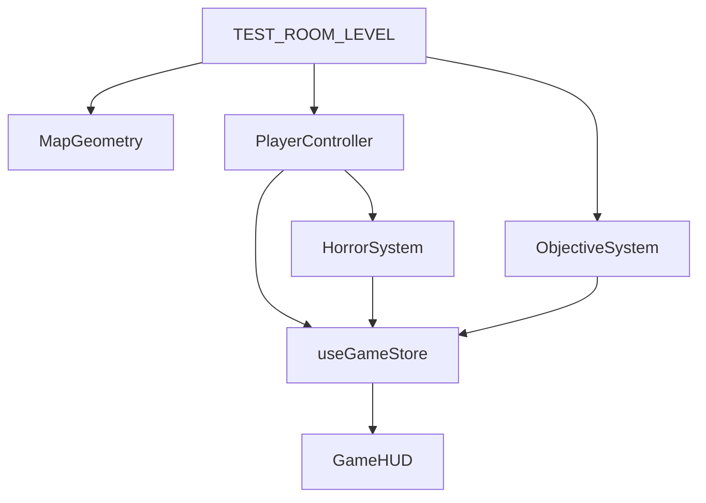

# World Model

## Objetivo

Este documento descreve o modelo de mundo usado pelo jogo durante a fase de teste da sala quadrada. A ideia é separar claramente dados do cenário, renderização 3D e lógica de gameplay, para que o mapa deixe de ser um conjunto de meshes hardcoded dentro do componente de cena.

## Princípios

- O mundo é descrito por dados, não por JSX espalhado.
- Objetos estáticos usam tipos simples e previsíveis.
- Entidades com comportamento próprio, como player e enemy, continuam em componentes ou sistemas dedicados.
- O nível ativo fornece bounds, spawn, zona de saída e posições de objetivos.

## Tipos Centrais

Os tipos do mundo vivem em [src/types/world.ts](src/types/world.ts).

- `StaticWorldObject` descreve piso, parede, teto e luzes estáticas.
- `LevelBounds` descreve limites de colisão e navegação.
- `ObjectiveSpawn` descreve posição e raio de coleta dos objetivos.
- `LevelDefinition` agrupa geometria, bounds, spawn e zonas do nível.

## Sala Quadrada de Teste

A primeira implementação usa a definição em [src/config/levels.ts](src/config/levels.ts).

Características atuais:

- Sala única e quadrada.
- Piso, teto e quatro paredes como objetos declarados em dados.
- Spawn do player no centro.
- Três objetivos posicionados dentro do perímetro.
- Zona de saída no lado norte da sala.

## Fluxo de Dados

## Responsabilidades

### MapGeometry

Renderiza somente a geometria declarada no nível. Não decide colisão nem regra de gameplay.

### PlayerController

Controla input, câmera, movimentação e colisão de navegação usando os bounds do nível ativo.

### ObjectiveSystem

Gerencia coleta e estado dos objetivos, lendo posições e raios do nível ativo.

### HorrorSystem

Calcula ansiedade usando as zonas do nível, em vez de depender de um layout específico de corredor.

## Quando Criar Componente Novo

Crie um componente específico quando o objeto tiver comportamento próprio ou integração com sistemas, como `Player` ou `Enemy`.

Use um renderer genérico quando o objeto for apenas visual e puder ser descrito por posição, tamanho e material.

## Próximo Passo

Quando houver mais de um nível, o próximo passo é transformar `TEST_ROOM_LEVEL` em uma coleção de níveis e deixar a cena selecionar a definição ativa por estado de jogo ou seleção do menu.
